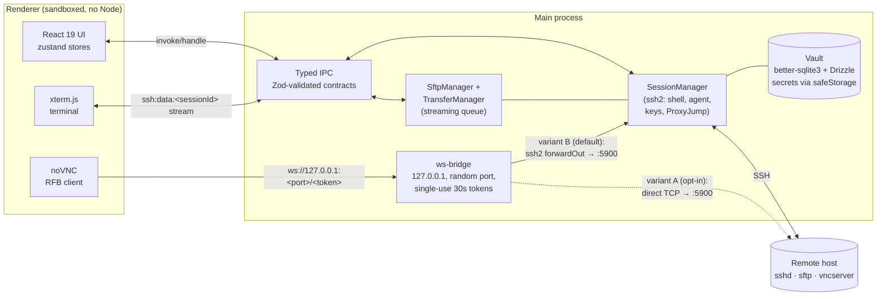

<div align="center">

# TermDesk

**A cross-platform SSH + SFTP + VNC + RDP desktop client — multi-tab terminals, streaming file transfers and remote desktops (VNC over SSH, plus native RDP), in one window.**


*Status: shipping — SSH terminal, SFTP, VNC over SSH, native RDP, MCP agent access, SSH tunnel manager, fleet automation, local terminals with a choice of terminal program (login shell / tmux / Zellij / screen / alternate shells), Prompt Book + scheduled Routines, settings, command palette and packaging.*

</div>

---

## ✨ Features

- 🖥️ **Flexible hosts** — create SSH-only, VNC-only, or combined hosts at creation time. SSH and VNC are independently optional. Pure VNC hosts support direct TCP or SSH-tunneled connections (with clear error if you try to tunnel without SSH creds). UI actions, command palette, and test buttons adapt per host kind.
- 🖥️ **Multi-tab SSH terminal** — xterm.js (WebGL) with search, copy/paste, resize; many parallel sessions to the same or different hosts. Early output is buffered until the terminal attaches, so MOTD/banners aren't lost.
- 📁 **SFTP with a streaming transfer queue** — remote file browser, drag & drop (recursive folder upload), chunk-by-chunk streaming with constant memory, cancel/retry, edit-in-place with auto-upload on save.
- 🔒 **VNC over SSH** — noVNC rendered in-app, fed through a loopback WebSocket bridge guarded by **single-use, 30 s tokens**; default transport is an SSH `forwardOut` tunnel, so port 5900 is never exposed. Direct mode also supported for VNC-only hosts.
- 🖥️ **RDP** — connect to Windows/RDP hosts in-app via an IronRDP WASM client fed through an in-process **RDCleanPath** proxy (same single-use, 30 s-token, origin-checked, TLS-terminating shape as the VNC bridge), with **trust-on-first-use** server-certificate pinning.
- 🔐 **Encrypted vault** — hosts, groups, snippets and known hosts in SQLite; passwords/passphrases encrypted with OS-keychain-backed `safeStorage` the moment they arrive in the main process.
- 🛡️ **Host-key verification** — SHA256 fingerprint approval dialog on first connect, hard block on a same-type key change, and a distinct loud "possible man-in-the-middle" warning when a known host presents a key/type never trusted for it.
- 🪜 **ProxyJump** — multi-hop chains (`user@jump:port,next`) via chained `forwardOut`.
- 🔌 **SSH tunnel manager** — define, persist and start/stop **local (`-L`)** port forwards and **dynamic SOCKS5 (`-D`)** proxies from a sidebar panel, with a live status dot + throughput. Reuses an open terminal's connection when possible; destructive-free, owner-scoped, logged. See [`docs/TUNNELS.md`](docs/TUNNELS.md).
- 🪟 **Split panes** — view two sessions side by side or stacked (Alt-click a tab or the split toolbar), with a draggable divider. Great paired with multi-host automation for a live monitoring grid.
- 💻 **Local terminals** — `node-pty` shell tabs on your own machine, with saved working directories — no SSH required. Per-host default remote path is honored on connect.
- 🧩 **Choose your terminal program** — pick what runs when a terminal opens (Settings → General): your default login shell, a **multiplexer** (tmux, Zellij, GNU Screen — persist across restarts/disconnects) or an **alternate shell** (bash, zsh, fish, PowerShell, Nushell). Only programs detected on your machine are selectable; the choice applies to both local terminals and SSH sessions (exec'd on the remote when present, else a plain shell).
- 🚀 **Open in external terminal** — hand the current directory off to your favorite GUI terminal — **Ghostty, Warp, iTerm2, kitty, Alacritty, WezTerm, GNOME Terminal, Konsole, Windows Terminal** — detected on your machine, with a saved default (Settings → General), from ⌘K or a one-click button on any local terminal tab.
- ⚡ **Fleet automation** — run a snippet or command across a whole group of SSH hosts at once, with live per-host streaming output.
- 🕘 **Activity log** — a local timeline of connects/disconnects, SFTP/VNC opens and automation runs. Metadata only: secret-bearing command tokens are redacted and entries purge after 90 days.
- 🎨 **Terminal color schemes** — built-in Dracula, Solarized Dark, Gruvbox, One Dark, Nord (plus the default), per your preference.
- 🧱 **Customizable sidebar** — show or hide each left-sidebar section (Hosts, Local terminals, Workspaces, Tunnels, Snippets, Prompt Book, Routines) from Settings → General or the sidebar's *Customize* button. Your choice persists; everything is visible by default.
- 🧩 **Prompt Book** — reusable, templated prompts for AI agents. Prompts are plain text with `{{variable}}` placeholders (optionally `{{name:default}}` / `{{name|description}}`); running one asks for the values, shows a live preview, and either sends the rendered text to the **active terminal** (SSH or local) or launches it in an **AI agent** — Claude Code, Aider, OpenCode, Codex or Gemini — in a directory you pick. Templating is pure substitution (no eval) and the prompt is passed as a single quoted argument, so shell metacharacters in it are inert.
- 🔁 **Routines** — saved "run *this prompt* through *this agent* in *this directory*" jobs, run on demand or on a schedule (interval / daily / cron), each with its own **run history**. Routines fire while TermDesk is open, and a run missed while the app was closed **catches up once** on next launch instead of stampeding every missed slot. Unattended autonomy is opt-in and off by default; stored run summaries are secret-redacted.
- 📋 **Snippets** — saved commands sent to the active session.
- ⌨️ **Command palette** — `⌘/Ctrl+K` fuzzy host search + every command (terminals, SFTP, VNC, automation, logs); press `?` for the shortcuts cheat-sheet.
- ⚙️ **Settings** — theme (dark / light / **System**, following the OS), terminal font + color scheme, right-click-paste behavior, SSH keepalive; plain JSON, never secrets.
- 🤖 **AI agent access (MCP)** — let Claude, Cursor, Grok or any [MCP](https://modelcontextprotocol.io) client *use* TermDesk: list hosts, run commands, fan out across a fleet. The agent gets **hands, never keys** — credentials stay in the main process, every action is per-host opt-in + approval-gated + shown live in an **AI Activity** log. Off by default. See [`docs/MCP-INTEGRATION.md`](docs/MCP-INTEGRATION.md).
- 🏠 **Local-first** — your hosts, keys and history never leave your machine; no mandatory cloud account, no telemetry.

## 🏗 Architecture

All SSH/SFTP/VNC logic lives in the **main process**. The renderer is fully sandboxed (`contextIsolation: true`, `nodeIntegration: false`, `sandbox: true`) and talks to it only through a typed, Zod-validated IPC contract (`src/shared/ipc.ts`).



Two deliberate exceptions to "secrets stay in main": the stored **VNC** password (for the RFB credentials handshake) and the stored **RDP** password (for the IronRDP client) are decrypted in main and returned to the renderer. Neither is currently bound to an open tab or rate-limited — see [Known limitations](SECURITY.md#known-limitations).

## 🚀 Quick start

```bash
npm install        # also applies the better-sqlite3 patch + rebuilds native deps
npm run dev        # electron-vite dev server + Electron window, HMR
```

> **First run:** `npm install && npm run dev` opens a usable app — there is no
> licence check, no seat and no account. See [`CONTRIBUTING.md`](CONTRIBUTING.md)
> for the full development setup, including the `better-sqlite3` ABI step you need
> before `npm test` will run.

| Script | What it does |
|---|---|
| `npm run dev` | electron-vite dev server + Electron window |
| `npm run build` | typecheck (TS strict) + production build to `out/` |
| `npm run lint` / `lint:fix` | biome check (format + lint) |
| `npm test` | vitest (unit + integration) |
| `npm run test:coverage` | vitest with v8 coverage |
| `npm run dist` | build + electron-builder (dmg / NSIS / AppImage) |

`npm run dist` produces `dist/TermDesk-<version>-arm64.dmg` on Apple Silicon macOS (verified to launch). See [`INSTALL.md`](INSTALL.md) for per-OS download & install instructions.

## 🧪 Dev test environment

A single Docker container provides SSH + TigerVNC for local testing — no real servers needed:

```bash
npm run test:keys                                  # throwaway SSH keys (untracked)
docker compose -f docker-compose.test.yml up -d
```

| Service | Endpoint | Credentials |
|---|---|---|
| SSH | `127.0.0.1:2222` | `testuser` / `testpass123`, or the generated keys in `.test/` (`test_key`, `test_key_enc`) |
| VNC | `127.0.0.1:5901` (direct or via the SSH tunnel — same container) | `testvncpass` |

### E2E smoke harnesses

Five self-contained end-to-end suites run inside the real Electron app (the first four against the docker container; the MCP suite needs no external services). Each prints an `*_OK` marker on success:

| Command | Proves | Verified result |
|---|---|---|
| `TERMDESK_SMOKE=vault npx electron .` | Secrets are `safeStorage`-encrypted before persisting; no plaintext in SQLite; never returned to the renderer | `VAULT_SMOKE_OK` |
| `TERMDESK_SMOKE=ssh npx electron .` | Real logins with password, key, and key + encrypted passphrase | `SSH_SMOKE_OK` |
| `TERMDESK_SMOKE=sftp npx electron .` | 1 GB upload + download with RSS monitoring (peak 259 MB — under the 300 MB budget) and a 500-file folder upload | `SFTP_SMOKE_OK` |
| `TERMDESK_SMOKE=vnc npx electron .` | RFB handshake both direct and over the SSH tunnel; forged-token connections rejected; tokens are single-use | `VNC_SMOKE_OK` |
| `TERMDESK_SMOKE=mcp npx electron .` | Token-gated MCP server starts on loopback; a forged bearer token is rejected | `MCP_SMOKE_OK` |

## ✅ Testing

```bash
npm test                # 637 unit/integration tests across 69 files — all green
npm run test:coverage   # v8 line coverage: 36.82% (2340/6355 lines)
```

Vitest runs renderer tests under jsdom (Testing Library) and everything else under node. Coverage is concentrated where it counts — pure logic is high, while process-glue and UI shells are covered by the five e2e smokes instead of unit tests:

- **High (lines):** `shared` 97.1% — the Zod IPC contract every process depends on — `renderer/lib` 97.5%, `main/store` 81.4% (db, hosts-repo, settings and snippets-repo at or near 100%), `ssh-util` 100%, the `~/.ssh/config` parser and its `Include` resolver in the high 90s.
- **Low, and covered by the smokes instead:** `main/ipc` handler glue 9.8%, `session-manager` and `sftp-manager`/`transfer-manager` 0%, `vnc-manager` and the UI shells (`SftpTab`, `TerminalView`, `VncTab`, layout and the sidebar panels) low or zero. These are process glue and Electron/DOM shells; the `TERMDESK_SMOKE` harnesses exercise them end to end against a real server. Entry points and `*-smoke.ts` files are excluded from coverage by config.

Build + typecheck + lint are clean, and a headed dev launch logs zero error lines.

## ⌨️ Keyboard shortcuts

| Shortcut | Action |
|---|---|
| `⌘/Ctrl+K` | Command palette (fuzzy host search + commands) |
| `⌘/Ctrl+T` | New session (opens the palette) |
| `⌘/Ctrl+W` | Close active tab |
| `⌘/Ctrl+F` | Search in terminal |
| `⌘/Ctrl+Shift+C/V` | Copy/paste in terminal |

## ⚙️ Settings

Theme (dark, light, or System — following the OS `prefers-color-scheme`), terminal font size/family, SSH keepalive interval — stored as plain JSON in `userData/settings.json` (never secrets).

## 📡 Feature details

### SSH terminal

- All ssh2 logic lives in the main process (`src/main/ssh/session-manager.ts`); the renderer only sees a typed stream API. Output streams on `ssh:data:<sessionId>`; early output is buffered until the terminal attaches.
- Auth: vault password (with keyboard-interactive fallback), private key (+ encrypted passphrase), or SSH agent (`SSH_AUTH_SOCK`, Windows OpenSSH pipe). Secrets are decrypted only at connect time.
- Host keys: first connect shows a SHA256 fingerprint approval dialog and persists to the `known_hosts` table; a mismatch hard-blocks the connection.
- ProxyJump chains (`user@jump:port,next`) via chained `forwardOut`; keepalive 15 s.

### SFTP

- SFTP sessions reuse the live SSH connection of an open terminal to the same host (no second login) and fall back to a dedicated shell-less connection.
- Transfers stream chunk-by-chunk (constant memory — 1 GB verified under 300 MB RSS) and are cancellable/retryable; folder drops upload recursively with structure preserved.
- Edit-in-place downloads to a temp file, opens the OS editor and auto-uploads on save.

### VNC

- noVNC renders in the renderer; it speaks WebSocket to a main-process bridge bound to `127.0.0.1` on a random port. Every connection requires a **single-use, 30 s token** — other local processes can't ride the bridge (hence `ws://127.0.0.1:*` in the CSP).
- Default transport is an SSH `forwardOut` channel (variant B — port 5900 never exposed), reusing a live terminal connection to the host when one exists; plain TCP (variant A) is opt-in per host.
- The stored VNC and RDP passwords are decrypted in main and returned to the renderer for their respective clients — the two documented exceptions to "secrets stay in main".
- Toolbar: local scaling / remote resize toggles, clipboard paste, Ctrl+Alt+Del, fullscreen, reconnect (each reconnect provisions a fresh token + tunnel).

### Vault

- Hosts, groups, snippets and known_hosts live in SQLite (better-sqlite3 + Drizzle) under the app's `userData` directory.
- Passwords/passphrases are encrypted with `safeStorage` (OS keychain key) in the main process the moment they arrive; only ciphertext blobs touch the database, and secrets are never sent back to the renderer.
- `~/.ssh/config` import parses Host/HostName/Port/User/IdentityFile/ProxyJump, **resolves `Include` directives** (tilde/relative/absolute paths and globs, with cycle/depth/size guards) and **merges `Host *`/wildcard defaults** into concrete hosts using OpenSSH first-obtained-wins ordering.

## 🔐 Security checklist

- [x] `contextIsolation: true`, `nodeIntegration: false`, `sandbox: true` — the renderer and preload never touch Node.
- [x] Strict CSP via meta tag: `script-src 'self'`, **no `unsafe-eval`**, no remote module; `connect-src` allows only `'self'` and loopback WebSockets (the token-gated VNC bridge). Dev-only relaxation happens through a Vite plugin that fails loudly on drift.
- [x] `webSecurity: true`; navigation origin-checked; `window.open` denied (external `https:` → system browser); `<webview>` blocked; permission requests denied by default.
- [x] Every IPC payload is validated with Zod (`src/shared/ipc.ts` is the single contract); invoke results are typed end-to-end via `IpcInvokeMap`.
- [x] Secrets (SSH/VNC passwords, key passphrases) are encrypted with `safeStorage` in the main process the moment they arrive; only ciphertext is persisted; decryption happens at connect time and references are dropped immediately. Verified by `TERMDESK_SMOKE=vault`. Two documented exceptions: the VNC and RDP passwords cross to the renderer for their protocol clients (see [Known limitations](SECURITY.md#known-limitations)).
- [x] Errors crossing IPC are sanitized (first line only, no stacks/paths); secrets are never logged.
- [x] Sessions, SFTP handles, transfers and host-key prompts are owner-scoped to the WebContents that created them and torn down when it is destroyed.
- [x] Host keys: SHA256 fingerprint approval on first connect, hard block on mismatch — for the final target **and every ProxyJump hop**.
- [x] Activity log is metadata-only: OS username, secret-bearing command tokens redacted, 90-day purge.
- [ ] Optional master password (Argon2id-derived second encryption layer) — deferred, tracked as a future enhancement.

See [`SECURITY.md`](SECURITY.md) for the full security model, the known limitations, and the vulnerability-disclosure policy.

## 📂 Project structure

```
src/
  main/                  # Electron main process — all SSH/SFTP/VNC logic lives here
    ipc/                 # IPC handlers per domain (ssh, sftp, vnc, hosts, …)
    ssh/                 # session-manager, ssh-config-parser, ssh-util (+ smoke)
    sftp/                # sftp-manager, transfer-manager, edit-watch (+ smoke)
    vnc/                 # ws-bridge, vnc-manager (+ smoke)
    store/               # Drizzle + better-sqlite3, secrets (safeStorage), settings
  preload/               # contextBridge — typed, minimal API surface (window.api)
  renderer/              # React UI (no Node access)
    components/{layout,hosts,terminal,sftp,vnc,snippets,ui}/
    hooks/  stores/  lib/
  shared/                # IPC channel contracts + Zod schemas shared by all processes
```

## 🗺 Known limitations / roadmap

- **Master password** — optional Argon2id-derived second encryption layer over the vault; deferred.
- **Playwright smoke test** (launch app → add host → mock connection) — deferred; the five `TERMDESK_SMOKE` harnesses cover e2e today.
- **`~/.ssh/config` import** — `Match` blocks and token expansion (`%h`/`%p`) are still skipped; cloud-provider inventory import (AWS/GCP) is not implemented.

See [`SECURITY.md`](SECURITY.md#future-hardening) for the hardening roadmap.

## 🔧 Native-module notes

- **better-sqlite3** needs a source patch to compile against Electron's V8 (no upstream prebuilds yet) — applied automatically via `patch-package` on `npm install` (`patches/better-sqlite3+12.10.0.patch`).
- **cpu-features** (optional ssh2 native dep) is overridden to `noop2` in `package.json` to avoid an unnecessary native build; ssh2 falls back to its pure-JS path.

## 🤝 Contributing

Issues and pull requests are welcome. [`CONTRIBUTING.md`](CONTRIBUTING.md) has the development setup
— including the two native-module traps that will otherwise cost you an afternoon — the invariants new
code has to keep, and the pre-PR checklist. Contributions are **inbound=outbound MIT**: no CLA, no
copyright assignment.

Participation is governed by the [Code of Conduct](CODE_OF_CONDUCT.md). Security problems go through
the private channel in [`SECURITY.md`](SECURITY.md), never a public issue.

## 📄 License

The **source** in this repository is released under the **MIT License** — see
[`LICENSE`](LICENSE). You may use, modify, and redistribute it, including
commercially, as long as the copyright notice and licence text travel with it.

The **prebuilt installers** published on the Releases page are additionally
covered by [`EULA.txt`](EULA.txt), which governs those binaries; a build you make
yourself from this source is governed by `LICENSE` alone.

There is no licence check, seat activation or account in this client: the
commercial licensing subsystem was removed when the source was published, so
what you build from this repository is the whole application.

That boundary is enforced in code, not just described here: the first-run EULA
prompt is compiled into the project's own release builds only, so a fork's
`npm run dist`, a distro package or your own installer never shows it.

Third-party dependencies keep their own licences, listed in
[`THIRD-PARTY-NOTICES.md`](THIRD-PARTY-NOTICES.md). One carries an obligation
worth naming: `@novnc/novnc` is MPL-2.0 and this repository patches it
(`patches/@novnc+novnc+1.7.0.patch`), so that modification is published here
under MPL-2.0 along with the rest of the source.

